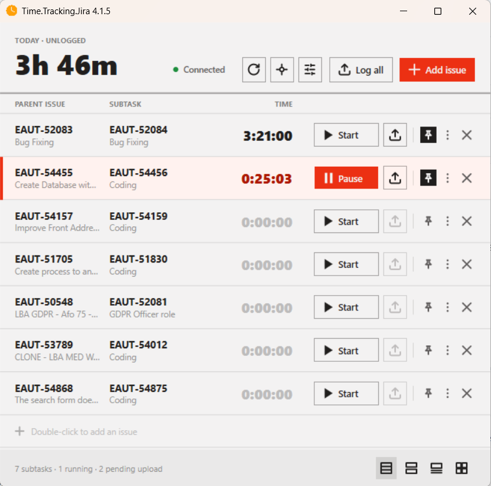

# Time.Tracking.Jira

A Windows desktop app for tracking time spent on Jira issues and logging it straight to Jira as worklogs.

This project started as a fork of [Jira StopWatch](https://github.com/cargeh/jirastopwatch) and has since been substantially rewritten: the UI moved to WPF and the app now targets .NET 10.



## Key features

- **Multiple simultaneous timers** — track time on several issues at once, each with its own stopwatch.
- **Four switchable views** (changed live, no restart needed): **Ledger** (table, default), **Cards**, **Focus** (one timer front and center), and **Grid** (keyboard-driven, chips `1`–`9`). A classic window is also available.
- **Start first, assign later** — a timer can be started before an issue is picked; the issue is only required when logging the work.
- **Log all** — review every row with time, edit each comment, choose which ones to submit, and post them to Jira in one batch.
- **Automatic reconnect** — if the app starts without network/VPN, it keeps retrying in the background and reconnects as soon as the network is back.
- **Pause on lock** — timers pause when the workstation locks and resume when it unlocks (configurable).
- **Issue picker backed by JQL filters**, plus manual add/edit of rows directly from the grid.
- **System tray support**, always-on-top option, and per-view window size memory.
- **Resilient settings** — a corrupted `settings.json` is backed up instead of silently discarded.

## Requirements

- Windows
- [.NET 10 SDK](https://dotnet.microsoft.com/download) (to build) / .NET Desktop Runtime 10 (to run a published build)
- A Jira Server/Data Center or Jira Cloud instance to connect to

## Building and running

```
Build-And-Run.bat            # builds Debug and launches it
Build-And-Run.bat Release    # builds Release and launches it
```

This builds `source\Time.Tracking.Jira\Time.Tracking.Jira.csproj` and starts the resulting executable. Since the app is single-instance, it will offer to close any already-running copy first. It uses the same settings file as an installed version (`%LOCALAPPDATA%\Seabury Solutions\Time.Tracking.Jira\settings.json`), so timers and the Jira connection are the real ones.

Alternatively, open `Time.Tracking.Jira.sln` in Visual Studio.

## Project layout

```
source/
  Time.Tracking.Jira/          Main WPF application
  Time.Tracking.Jira.Setup/    Inno Setup installer script and build script
  Time.Tracking.JiraTest/      Unit tests
changelog/                     Per-version changelog (<version>.md)
```

## Installer

The installer is built with [Inno Setup](https://jrsoftware.org/isinfo.php) via `source\Time.Tracking.Jira.Setup\Build-Installer.ps1`.

## Changelog

See the [changelog](changelog/) folder for a per-release history of user-facing changes.

## License

Apache License version 2.0 — see [LICENSE.txt](LICENSE.txt).

## Credits

Based on [Jira StopWatch](http://jirastopwatch.com) by Carsten Gehling. Jira communication uses .NET's built-in `HttpClient` — no third-party runtime dependencies.
